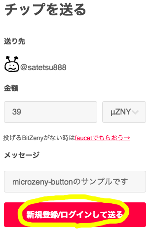
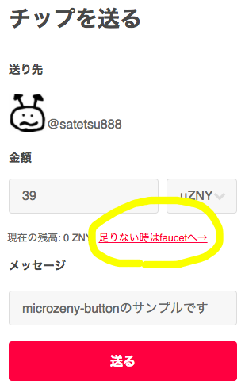
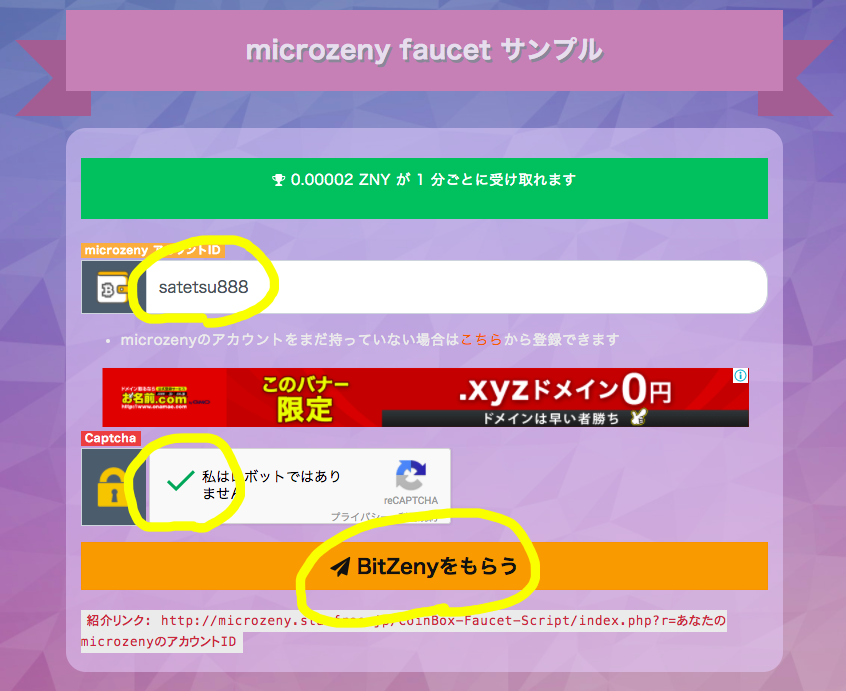

<meta name="viewport" content="width=device-width,initial-scale=1.0,minimum-scale=1.0">

## はじめに

もってない人からも受け取れる投げ銭サービスmicrozenyボタンの紹介です。

従来の投げ銭サービスでは日本円を送るものも仮想通貨を送るものも、全てで共通して「送りたい人は最初に元手をサービスに預ける必要がある」といういわば当たり前の前提があり、これがサービスを使いはじめる際の大きな障壁となっています。

ほんのちょっとした寄付を日本円でするためだけに、本名、住所、クレジットカードなど重要な個人情報の登録をするのは気が引けますし、
そのあたりが比較的自由な仮想通貨であっても、もっていない場合は取引所での購入とそのための本人確認という高いハードルがあります。
そのため従来の投げ銭サービスはサイト等に設置するだけでは、コンテンツに対して賞賛や感謝のために投げ銭をしようと思う人がいても、ほとんどの人は登録ハードルの高さに途中で諦めてしまっています。

microzenyボタンでは

1. Twitter連携でアカウントを識別し個人情報の入力は一切なし
1. 元手をサービスに預けなくても少額なら無料で貰ってそれを送れる

の2点を実現することで、ボタンを設置した人に対して少額の価値(BitZeny)とメッセージを即座に届けることができるようにしました。

送りたい人は、BitZenyを無料で配布しているサイトに行ってもらう、もらったものをmirozenyボタンを設置している人に投げる、というステップを踏むことになります。
元手なしの状態から投げ銭をするまでの具体的な手順を紹介します。

## 送りたい人の手順

1. サイトなどに設置されているmicrozenyボタンを押します(1秒)
2. こんなページにきたら[新規登録/ログインして送る]を押して、Twitter連携でログインします(5秒)
  - 

3. 登録時はもちろん残高をもっていないのでfaucetでいくらか無料でもらってきましょう(20-100秒)
  - faucetではmicrozenyのID(TwitterIDと同じ)の入力とreCaptchaのチェックが必要です。
  - 
 

4. 確認ページに戻ってきたら金額やメッセージを編集して先ほどもらったBitZenyを投げましょう(5秒)

以上で完了です。
Twitterアカウントさえもっていれば初めての人でも2,3分あればできてしまうと思います。

実際に動くサンプルとして僕のmicrozenyボタンを下記に設置しています。BitZenyをもっていない状態から投げ銭できるまでの流れをぜひお確かめください。

<a class="microzeny-button" data-microzeny-id="satetsu888" data-number="39" data-unit="μZNY" data-description="microzeny-buttonのサンプルです">BitZenyを送る</a>

## 受け取りたい人の準備

1. microzenyの[マイページ](https://microzeny.com/me)内のmicrozenyボタン発行リンクからタグを取得できます。ブログなどお好きなサイトに設置してください。
2. [設定](https://microzeny.com/settings)から通知設定をしておけば、投げ銭を受け取った通知を受け取ることもできます。

## FAQ

### BitZenyって何？

CPUでも採掘しやすい特徴をもつ日本生まれの仮想通貨です。
より詳しい情報は公式サイトやそこからリンクされているサイトからご確認ください。

公式サイト: [https://bitzeny.tech/](https://bitzeny.tech/)

### microzenyって何？

BitZenyのやりとりをサポートする決済ポータルサービスです。

仮想通貨をオンチェーンで正確にやりとりするのはブロックチェーンの仕様上それなりの時間がかかるため、
対面で即座に支払ったり受け取った支払いを即座に確認したりを実現するための一つの方法として、決済オフチェーンサービスを目指して作られたものです。

公式サイト: [https://microzeny.com/](https://microzeny.com/)
